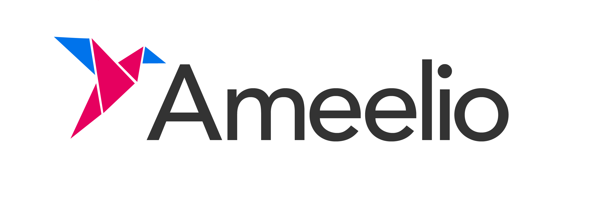

# Ameelio Letters Mobile

[](https://github.com/AmeelioDev/letters-mobile/actions?query=workflow%3ATests+branch%3A+master)
[](https://codecov.io/gh/AmeelioDev/letters-mobile)



A free and open-source platform for sending physical mail to your incarcerated loved-ones.

## Getting Started

These instructions will get you a copy of the project up and running on your local machine for development and testing purposes.

### Prerequisites

* Install [Node.js](https://nodejs.org/en/)
* Install [npm](https://www.npmjs.com/get-npm)
* Install [Expo CLI](https://docs.expo.io/workflow/expo-cli/)

### Installing

#### Install Project Dependencies

To install dependencies run

```
npm install
```

#### Configuring Environment Variables

Create a file .env in the project root. In that file, add the line

`MOCK_API_IP = [your IPv4 local IP address]`

#### Starting the Project

To start the local development server run

```
npm run start
```

Visit http://localhost:19002/ in your browser and you should see the Metro Bundler page. From here you can follow the instructions in your terminal to launch the app with live reloading on your device. Hooray, you've successfully installed and run the Ameelio Letters mobile application!

Start the mock backend API in another terminal by running

## Running the tests

### Run unit tests

```
npm run test
```

### Viewing test coverage

```
npm run test:coverage
```

## Built With

* [React Native](https://reactnative.dev/) - The cross-platform framework used
* [npm](https://reactnative.dev/) - Dependency Management

## Contributing

Please read [CODE_OF_CONDUCT.md](CODE_OF_CONDUCT.md) for details on our code of conduct, and [CONTRIBUTING.md](CONTRIBUTING.md) for the process for submitting pull requests to us.

## Authors

See the list of [contributors](https://github.com/AmeelioDev/letters/contributors) who participated in this project.

## License

This project is licensed under the GPLv3 License - see the [LICENSE.md](LICENSE.md) file for details
